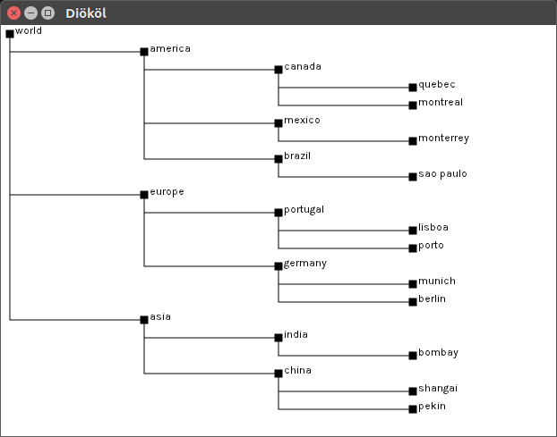
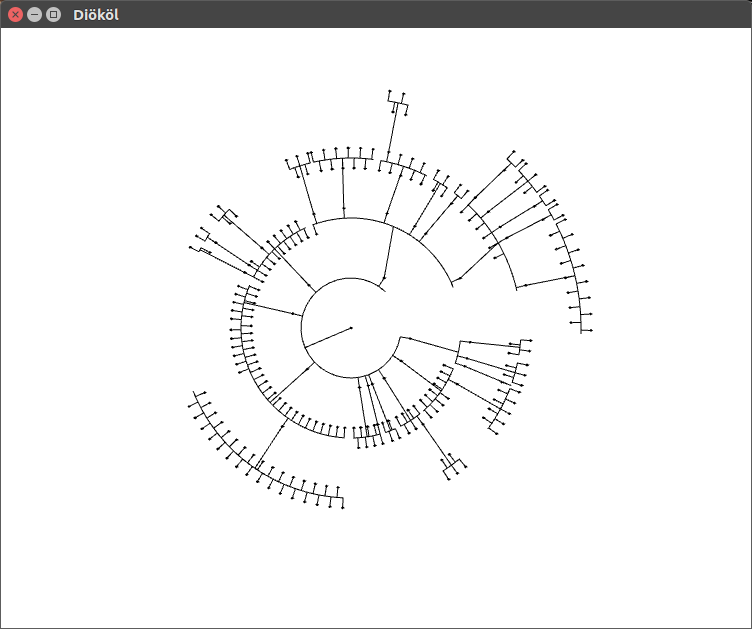
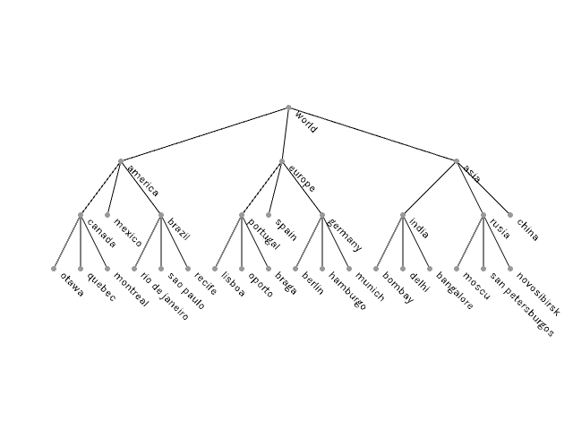
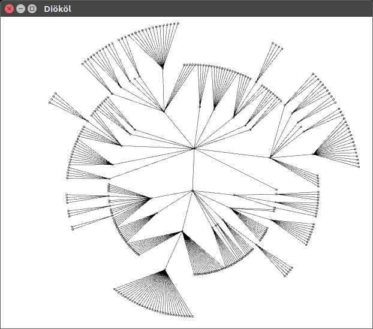

# Diokol-Information-Visualizers
Four examples of information visualizers for Diokol drawing environment

[Examples and Contributions](https://gist.github.com/arce/c1b41b6759c254d55747fd70f9fb6179)
